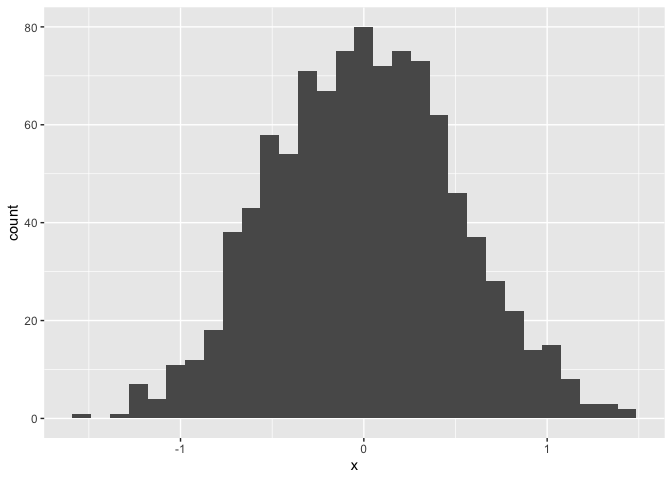

Simple document
================
Sarah Younes
2023-09-12

``` r
library(tidyverse)
```

    ## ── Attaching core tidyverse packages ──────────────────────── tidyverse 2.0.0 ──
    ## ✔ dplyr     1.1.3     ✔ readr     2.1.4
    ## ✔ forcats   1.0.0     ✔ stringr   1.5.0
    ## ✔ ggplot2   3.4.3     ✔ tibble    3.2.1
    ## ✔ lubridate 1.9.2     ✔ tidyr     1.3.0
    ## ✔ purrr     1.0.2     
    ## ── Conflicts ────────────────────────────────────────── tidyverse_conflicts() ──
    ## ✖ dplyr::filter() masks stats::filter()
    ## ✖ dplyr::lag()    masks stats::lag()
    ## ℹ Use the conflicted package (<http://conflicted.r-lib.org/>) to force all conflicts to become errors

I’m an R Markdown document!

# Section 1: First code chunk

Here’s a **code chunk** that samples from a *normal distribution*:

``` r
samp = rnorm(100)
length(samp)
```

    ## [1] 100

# Section 2: Make a plot

This code is borrowed from the last lecture; it creates a dataframe for
plotting.

``` r
plot_df = tibble(
  x = rnorm(1000, sd = .5),
  y = 1 + 2 * x + rnorm(1000)
)
```

Next up is a histogram of the ‘x’ variable in ‘plot_df’.

``` r
ggplot(plot_df, aes(x = x)) + geom_histogram()
```

    ## `stat_bin()` using `bins = 30`. Pick better value with `binwidth`.

<!-- -->

# Section 3: Learning assessment

Here is a test data frame from the learning assessment:

``` r
example_df = tibble(
  norm_samp = rnorm(500, mean = 1),
  norm_samp_pos = norm_samp > 0,
  abs_norm_samp = abs(norm_samp)
)
```
